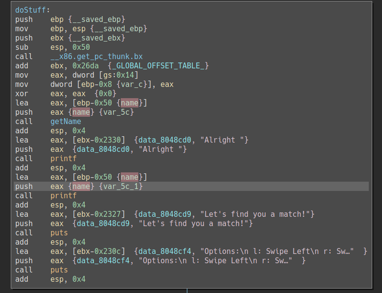

TUCTF 2018: Timber
==================

## Description

Difficulty: easy
Are you a single lumberjack tired of striking out? Well not
with Timber! Our deep learning neural network is sure to find a perfect match
for you. Try Timber today!

`nc 18.222.250.47 12345`

## Solution

The interesting functions in the target are `doStuff` which displays the
interface, and `date` which prints the flag.

By looking at the disassembly of `doStuff` we can see that the second call to
`printf` uses a user-controlled format string which we can exploit to read and
write arbitrary memory.



The binary is compiled with partial RELRO, which means that the GOT entries are
writable. The easiest way to get the flag is to overwrite the GOT entry for
`puts` with the address of `date`. This way the call to `puts` will instead
execute `date` and give us the flag.

Pwntools has a useful helper for generating format string exploits but it needs
to know which is the first format argument that we can control. The easiest way
to find out is to try `%s`, then `%x%s` and so on until the target crashes.  In
this case `%x%s` crashes the target which means that we control the arguments
starting from the second.

```
$ python2 exploit.py
[+] Opening connection to 18.222.250.47 on port 12345: Done
TUCTF{wh0_64v3_y0u_7h47_c4n4ry}

[*] Closed connection to 18.222.250.47 port 12345
```
